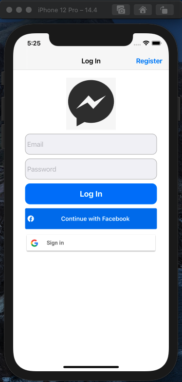
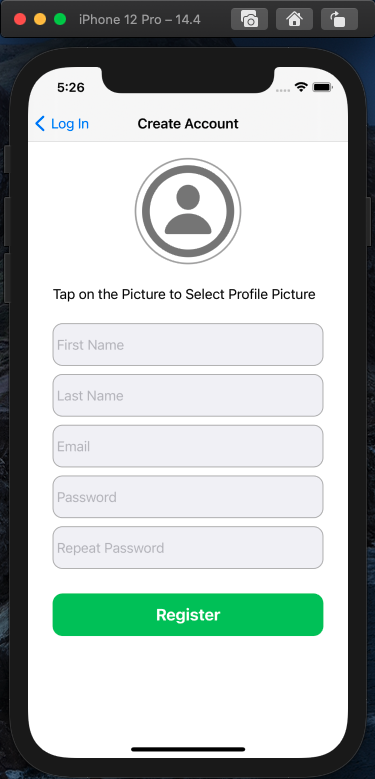
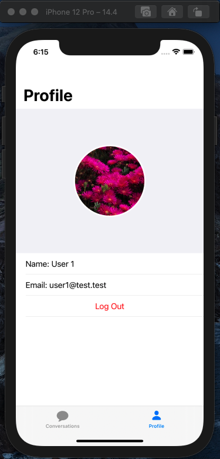
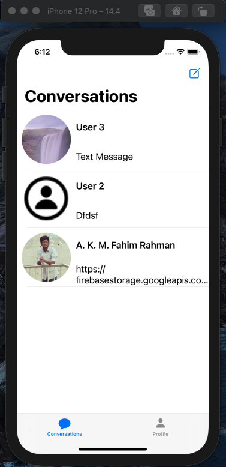
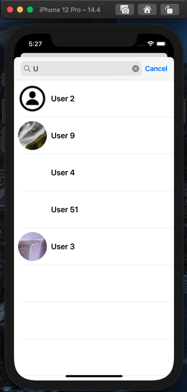

## Messenger     
     
### Features
    1. user can sign up using email/password
    2. user can login using registered email/using facebook/using google account
    3. user find other users searching by ther name
    4. user can send Text, Photo and Video Messages 
    5. User can delete a conversation
    
### ScreenShots
    
Login:  
  

Registration:  
  

userProfile:  
  

AllConversationsList:  
  

Conversation:  
  
 
SearchUser:  
  

